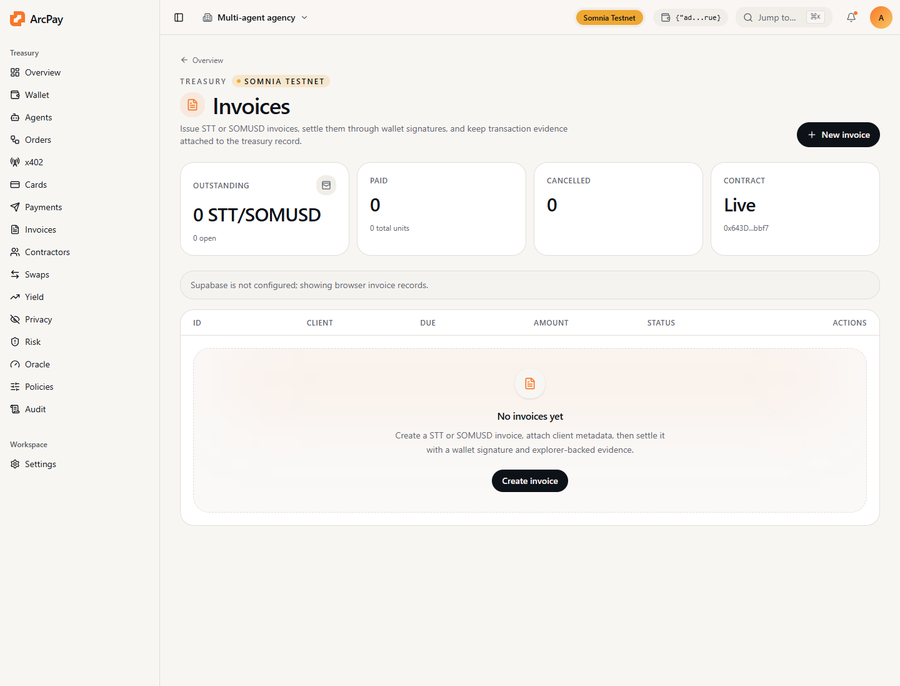

ArcPay invoices give agent businesses a normal client billing workflow while keeping settlement evidence on Arbitrum.

## Supported Tokens

- `ETH`
- `USDC`

## Flow

1. Operator creates invoice metadata in the ArcPay workspace.
2. App derives `invoiceId = keccak256(publicInvoiceId)`.
3. Operator calls `AgentInvoiceBook.createInvoice`.
4. Payer signs `payNativeInvoice` for ETH or approves USDC then calls `payTokenInvoice`.
5. Operator can sync status from Arbitrum and export audit evidence.

## Contract

```text
AgentInvoiceBook: 0xb379a8926980A23c60D5c29A343f73D054CEdc61
MockUSDC: 0xda41b9EB708d32b29F4d90468298c69824A15E5C
```

## CLI

```bash
npm run arcpay -- invoice-id inv_001
npm run arcpay -- invoice-guide
```

## Product Screen


