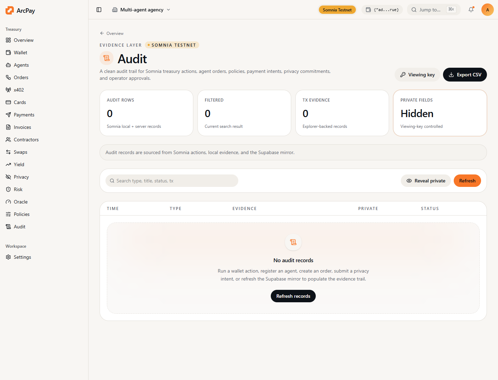

Use this page to verify that the app, docs, x402 backend, developer API, and Arbitrum contracts are live.

## Public Endpoints

| Surface | URL |
| --- | --- |
| App | `https://arcpay-arbitrum.vercel.app` |
| Docs | `https://arcpay-arbitrum.vercel.app/docs/overview` |
| App docs path | `https://arcpay-arbitrum.vercel.app/docs` |
| OpenAPI | `https://arcpay-arbitrum.vercel.app/openapi.json` |
| Agent context | `https://arcpay-arbitrum.vercel.app/llms.txt` |
| HTTP developer tools | `https://arcpay-arbitrum.vercel.app/api/developer/tools` |
| Hosted MCP bridge | `https://arcpay-arbitrum.vercel.app/api/mcp` |
| Admin analytics | `https://arcpay-arbitrum.vercel.app/analytics` |
| Admin analytics API | `https://arcpay-arbitrum.vercel.app/api/admin/analytics` |
| x402 health | `https://arcpay-arbitrum.vercel.app/api/health` |
| x402 demo | `https://arcpay-arbitrum.vercel.app/api/x402/demo` |

## Curl Checks

```bash
curl https://arcpay-arbitrum.vercel.app/openapi.json
curl https://arcpay-arbitrum.vercel.app/llms.txt
curl https://arcpay-arbitrum.vercel.app/api/developer/tools
curl https://arcpay-arbitrum.vercel.app/api/developer/tools/derive_agent_id?slug=research-agent
curl -X POST https://arcpay-arbitrum.vercel.app/api/mcp \
  -H "content-type: application/json" \
  -d '{"jsonrpc":"2.0","id":"1","method":"tools/list","params":{}}'
curl https://arcpay-arbitrum.vercel.app/api/health
curl https://arcpay-arbitrum.vercel.app/api/x402/payment-requirements/research-agent
```

`/api/admin/analytics` requires an admin wallet session and reads
`arcpay_arbitrum_usage_events`, `arcpay_arbitrum_beta_signups`,
`arcpay_arbitrum_developer_keys`, and `arcpay_arbitrum_records`.

## Local Checks

```bash
npm run docs:check
npm run build:frontend
npm test
npm run check:worker
npm run check:x402
npm run smoke:auth
npm run smoke:live
npm run smoke:x402
ARBISCAN_API_KEY=your_arbiscan_key npm run verify:arbitrum
```

`smoke:live` requires a funded Arbitrum Sepolia wallet. It writes small live transactions to validate registry, policy, orders, reputation, cards, privacy intents, invoices, and risk oracle flow.

Run `smoke:live` and `smoke:x402` sequentially. They share the funded signer and should not be run in parallel because public RPC nonce handling can reject concurrent transactions.

## Latest Verified Scope

- Contract suite: registry, order book, treasury policy, spend cards, operator controls, privacy vault, invoices, reputation, and risk oracle
- Arbiscan source verification: all 12 deployed contracts are verified on Arbitrum Sepolia
- Live smoke: registry write, policy write, order escrow/settle, reputation review, claim code, webhook breaker, USDC card, ETH privacy release, USDC privacy release, invoice settlement, risk oracle
- Arbitrum proof capture: `npm run proof:arbitrum` writes `proofs/arbitrum-live-proof.json` with execution adapter address, x402 order, unlock, settlement, privacy release, invoice payment, and audit evidence.
- x402 smoke: health, agent registration, HTTP 402 quote, on-chain payment order, verification, provider fulfillment, protected resource unlock, requester settlement
- Frontend build: all public, auth, dashboard, and operator pages compile
- Developer surfaces: CLI syntax, local MCP syntax, hosted MCP bridge, x402 server syntax, worker syntax, OpenAPI JSON, and docs config
- Usage analytics: app records, beta signups, developer tools, hosted MCP, and x402 gateway events are recorded into Supabase when the usage migration is applied

## Contract Proofs

All deployed contract addresses are listed in `arbitrum-contracts` and in
`deployments/arbitrum-sepolia.json`. Use `npm run verify:arbitrum` with a
`ARBISCAN_API_KEY` to verify source code on Arbiscan from the exact
constructor arguments in that deployment file.

## Audit Screen


